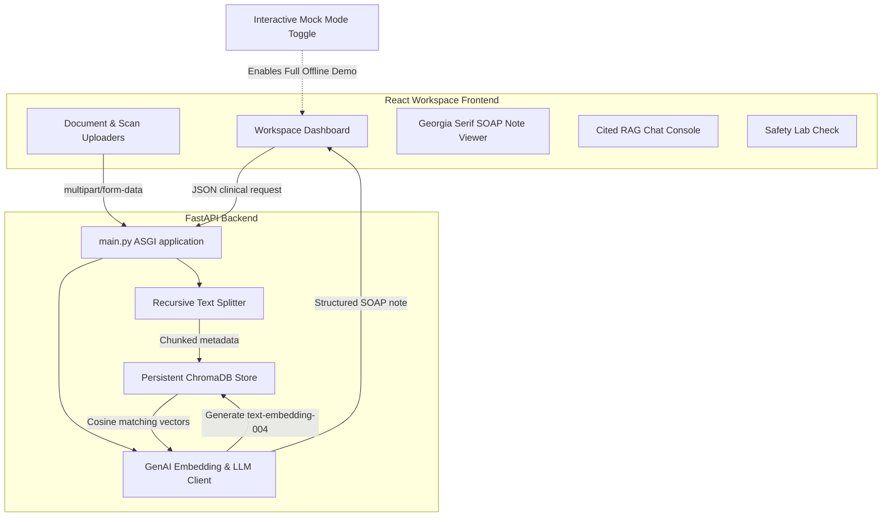

# 🩺 Medai: AI Clinical Decisions & Multimodal RAG Workspace

**Medai** is a state-of-the-art, clinical-grade full-stack Retrieval-Augmented Generation (RAG) and Multimodal workspace. It is engineered to assist healthcare professionals in compiling structured SOAP notes, conducting dense vector scans of clinical documentation, analyzing medical images using advanced computer vision, and verifying drug interactions against safety matrices.

The system decouples backend algorithms from frontend presentation layers to guarantee clean execution, offline capability, high-fidelity formatting, and rigorous security boundaries.

---

## 🏛️ System Architecture

Medai is split into two isolated, modular environments that communicate over secure, CORS-validated REST endpoints:



### Advanced Systems Engineering Standards Applied:
1. **Isolated Prompts (XML Enveloping)**: Consistent with modern prompt engineering guidelines, all system and task-specific prompts are housed in `server/app/prompts.py` using well-structured XML tags. This separates algorithmic changes from software delivery routes.
2. **Defensive Schema Design**: Implements rigorous Pydantic v2 validation models (`SOAPNoteModel`) on the server. The LLM is forced to output structured JSON matching the model schema exactly, ensuring UI components render seamlessly without parsing anomalies.
3. **Recursive Character Chunking**: Integrates a custom semantic text splitter that divides documents (PDF, DOCX, TXT) along double newlines, single newlines, and spaces to preserve clinical context (default: 800-character chunks with 150-character overlap).
4. **Persistent Vector Indexing**: Employs a local ChromaDB store configured with the **Cosine Distance metric** to index and query vector spaces generated by Gemini's high-performance `text-embedding-004` model.

---

## 💎 Features

* **High-Fidelity SOAP Compiler**: Generates structured Subjective, Objective, Assessment, and Plan notes, complete with vitals, physical exam observations, and multi-tier differential diagnoses.
* **Multimodal Radiograph Study**: Leverages Gemini 2.5 Vision models to analyze diagnostic chest X-rays, identifying consolidation zones, pleural effusions, and recommending immediate correlations.
* **Grounded RAG Library**: Indexes reference documents instantly. RAG chats run vector matching to retrieve exact snippets, complete with file metadata, source paths, and matching confidence scores.
* **Drug Interaction Safety Lab**: Interrogates a safety matrix to evaluate potential drug-drug conflicts or contraindications against the compiled clinical plan.
* **High-Contrast Print Stylesheet**: Includes `@media print` overrides that automatically strip UI headers, sliders, upload widgets, and buttons. When printing (`Cmd+P`), the case report is formatted instantly as a premium, letterhead clinical record with elegant Georgia-serif typefaces and black-and-white print styling.
* **Out-of-the-Box Mock Mode**: Features a prominent header switch. If the FastAPI backend is offline or a Gemini API key is not configured, the app runs as a fully interactive local portfolio demonstration with populated clinical mock studies.

---

## 🚀 How to Run the Application

To run the application locally on macOS, verify your isolated environment paths and execute the following steps:

### 1. Launch the Backend Server
1. Navigate to the `/server/` directory:
   ```bash
   cd server
   ```
2. Activate your isolated virtual environment:
   ```bash
   source ../.venv/bin/activate
   ```
3. Install the dependencies:
   ```bash
   pip install -r requirements.txt
   ```
4. Copy the environment template and configure your **Gemini API Key**:
   ```bash
   cp .env.example .env
   # Open .env and insert: GEMINI_API_KEY=your_key_here
   ```
5. Start the FastAPI ASGI server:
   ```bash
   python main.py
   ```
   *The server is active at `http://localhost:8000/`. You can view live interactive API documentation at `http://localhost:8000/docs`.*

### 2. Launch the Frontend Client
1. Open a new terminal window and navigate to `/client/`:
   ```bash
   cd client
   ```
2. Start the Vite React development server:
   ```bash
   npm run dev
   ```
3. Open your browser and navigate to `http://localhost:5173/`.
4. To test live RAG ingestion and real-time medical scan processing, toggle the **Mock Mode Badge** in the header to switch to **"Live API Server Connect"** (badge turns green).

---

## 🛠️ Tech Stack

* **Frontend**: React 19, Vite, TypeScript, Lucide Icons, Pure Vanilla CSS (custom glassmorphism architecture).
* **Backend**: FastAPI, Uvicorn, Python 3.12, Pydantic v2, `google-genai` SDK.
* **Database**: ChromaDB (Vector Store, Cosine Similarity).
* **File Processing**: PyPDF, python-docx, standard multipart forms.
